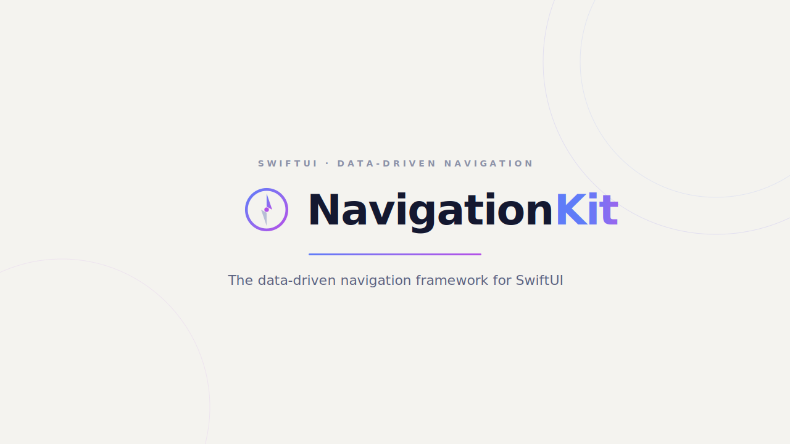
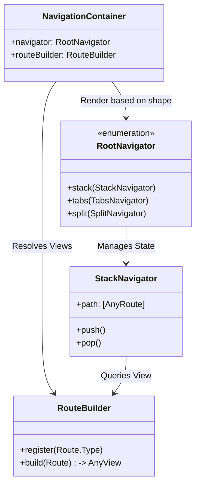
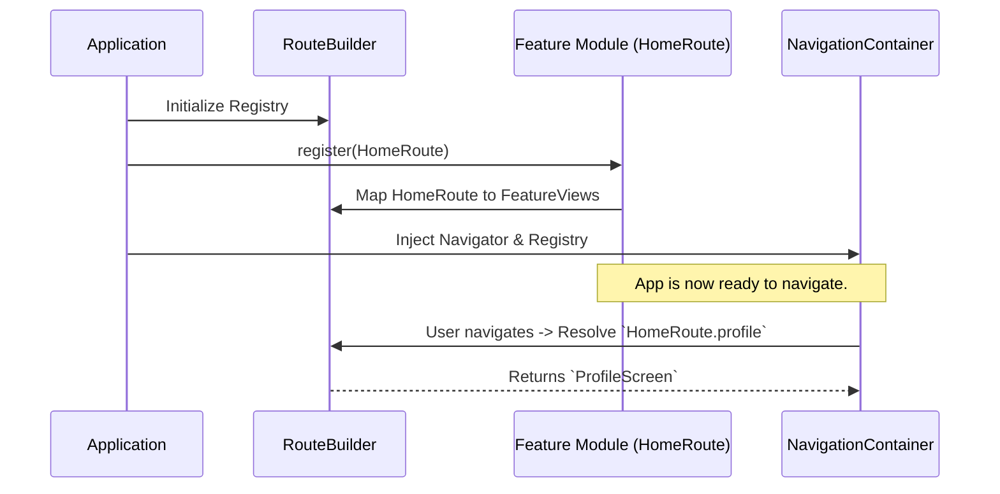

<div align="center">
  <picture>
    <source media="(prefers-color-scheme: dark)" srcset="Documentation/NavigationKit-editorial-dark.svg">
    
  </picture>

  [](https://github.com/linkandreas/NavigationKit/actions)
  [](https://swift.org)
  [](https://apple.com/ios)
  [](https://swift.org/package-manager/)
  [](https://opensource.org/licenses/MIT)

</div>

---

`NavigationKit` models your app's entire navigation hierarchy — stacks, tabs, split views, sheets, full-screen covers, alerts, and confirmation dialogs — as plain, observable, serializable state, so screens never reach for `NavigationLink`, `.sheet`, or `.fullScreenCover` directly.

## 💡 What issues does it solve?

Vanilla SwiftUI navigation modifiers couple a view to the navigation action that presents it. This approach makes deep linking, state restoration, previews, and testing harder than they need to be.

`NavigationKit` takes a radically different approach to solve these pain points:

- **True Decoupling:** Defines routes as plain `Hashable` values. A decoupled view registry maps route types to views, meaning a feature module can register its routes without the navigation layer needing to import that feature.
- **State-Driven First:** One state machine per shape (`StackNavigator`, `TabsNavigator`, and `SplitNavigator`). They are separate `@Observable` classes, meaning SwiftUI re-renders from them automatically — no bindings to wire by hand.
- **Out-of-the-box Deep Linking:** Turns a `URL` into a `NavigationState` snapshot using `DeeplinkResolver`, which can be seamlessly applied to your live navigator.
- **Snapshot-based State Restoration:** Describes a navigation tree as data, so you can persist it, restore it, or build it for a deep link without ever touching live views.
- **Visual Debugging:** Includes a built-in `NavigationKitDebug` debugger that overlays a live, inspectable graph of the navigation tree on top of your running app.

---

## 🛠 Requirements

- **iOS** 27.0+
- **Swift** 6.4+
- **Xcode** 27+

---

## 🚀 Installation

### Swift Package Manager

Add `NavigationKit` to your `Package.swift`:

```swift
dependencies: [
    .package(url: "https://github.com/linkandreas/NavigationKit.git", from: "1.0.0")
]
```

Then add the product(s) you need to your target:

```swift
.target(
    name: "MyApp",
    dependencies: [
        .product(name: "NavigationKit", package: "NavigationKit"),
        // Optional: a floating debugger overlay for DEBUG builds.
        .product(name: "NavigationKitDebug", package: "NavigationKit"),
    ]
)
```

Or, in Xcode: **File ▸ Add Package Dependencies…** and paste the repository URL.

---

## 📖 Quick Start

### 1. Define Routes

Routes are just `Hashable` values — typically an enum per feature.

```swift
enum HomeRoute: Hashable {
    case feed
    case profile(id: String)
}
```

### 2. Register Views

Map your features to their specific views via a registry.

```swift
let routeBuilder = RouteBuilder()
routeBuilder.register(HomeRoute.self) { route, navigator in
    switch route {
    case .feed:
        FeedScreen(navigator: navigator)
    case let .profile(id):
        ProfileScreen(userID: id, navigator: navigator)
    }
}
```

### 3. Create & Render Navigator

Initialize your navigator with a root route.

```swift
struct ContentView: View {
    let navigator = StackNavigator(root: HomeRoute.feed)
    let routeBuilder = routeBuilder // from step 2

    var body: some View {
        NavigationContainer(navigator: .stack(navigator), routeBuilder: routeBuilder)
    }
}
```

### 4. Navigate from Anywhere

Any screen that holds the navigator can push, pop, or present seamlessly.

```swift
navigator.push(HomeRoute.profile(id: "123"))
navigator.pop()
navigator.popToRoot()
```

---

## 📚 Documentation & Guides

- [Stacks, Tabs & Split Views](Documentation/StacksAndTabs.md) — building navigation hierarchies, tab containers, split views, nested navigators.
- [Modals](Documentation/Modals.md) — sheets, full screen covers, alerts, confirmation dialogs, error presentation.
- [Deep Linking](Documentation/DeepLinking.md) — parsing URLs into navigation state with `DeeplinkResolver`.
- [State Snapshots & Restoration](Documentation/StateSnapshots.md) — `StackState`, `TabsState`, `SplitState`, and each navigator's `apply(_:)`.
- [Debugging](Documentation/Debugging.md) — the `NavigationKitDebug` overlay.

Full API reference is available as a DocC catalog — see [Documentation.docc](Sources/NavigationKit/Documentation.docc).

---

## 🧩 Example App

[`Examples/ShowCaseApp`](Examples/ShowCaseApp) is a multi-module conference app that exercises the whole framework. Open `Navigator.xcworkspace` and run the `ShowCaseApp` scheme. 

Highlights:
- Adaptive root navigator (tab bar on iPhone, sidebar + detail split view on iPad).
- Per-feature Swift packages registering their own routes.
- Modal sheets hosting nested stacks.
- Deep links resolving into a selected tab and path simultaneously.

---

## 🏗 Architecture Overview

Curious how `NavigationKit` handles everything under the hood? Here's a high-level overview.

### The Navigation Core



### Route Registration Flow



---

## 🤝 Modules

| Target | Purpose |
| --- | --- |
| `NavigationKit` | Core framework: `StackNavigator`/`TabsNavigator`/`SplitNavigator`, route registry, deep linking, state snapshots, modal presentation. |
| `NavigationKitDebug` | Optional floating overlay window that visualizes the live navigation graph. Intended for DEBUG builds only. |

## 🧪 Testing

```bash
xcodebuild test \
  -scheme NavigationKit-Package \
  -destination 'platform=iOS Simulator,name=iPhone 17 Pro'
```

## 🤝 Contributing

Contributions are welcome — see [CONTRIBUTING.md](CONTRIBUTING.md) for how to set up the project, run the test suite, and submit changes. Please also read the [Code of Conduct](CODE_OF_CONDUCT.md).

## 📄 License

`NavigationKit` is released under the MIT license. See [LICENSE](LICENSE) for details.
