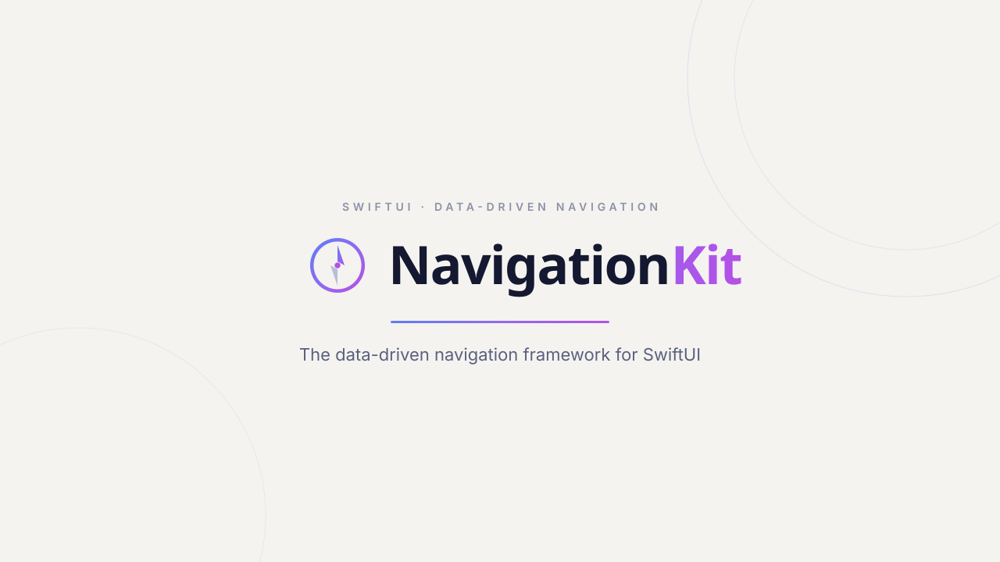
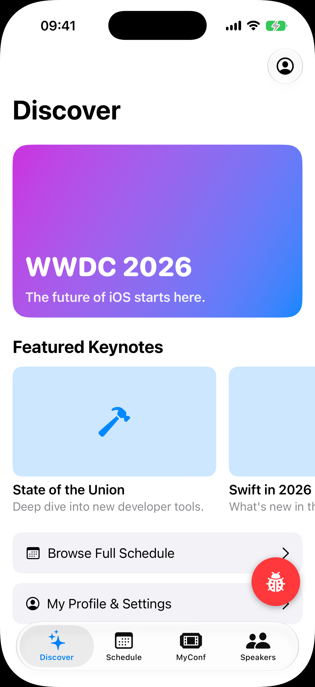
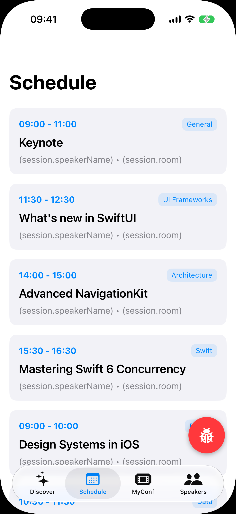
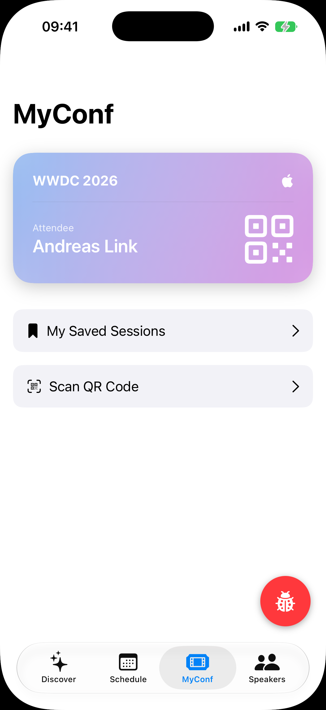
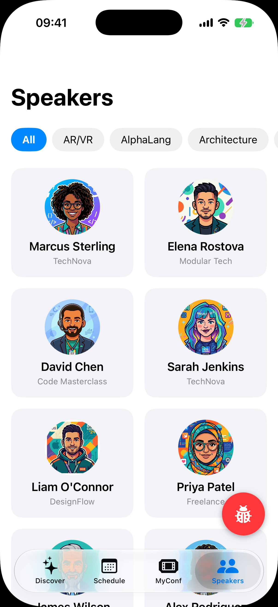
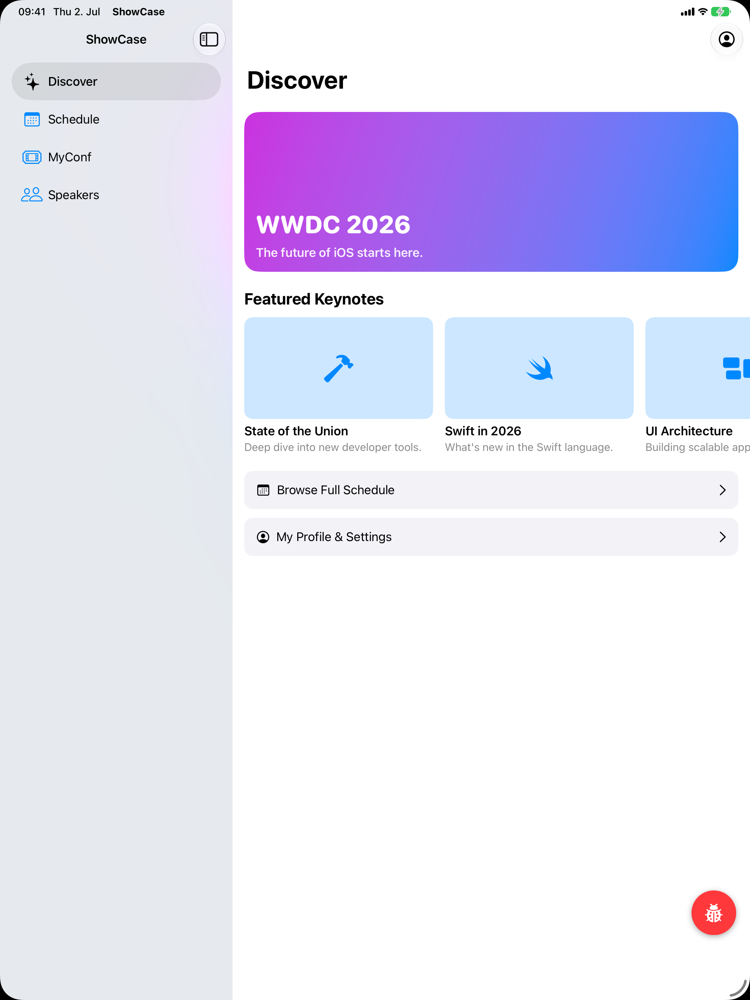
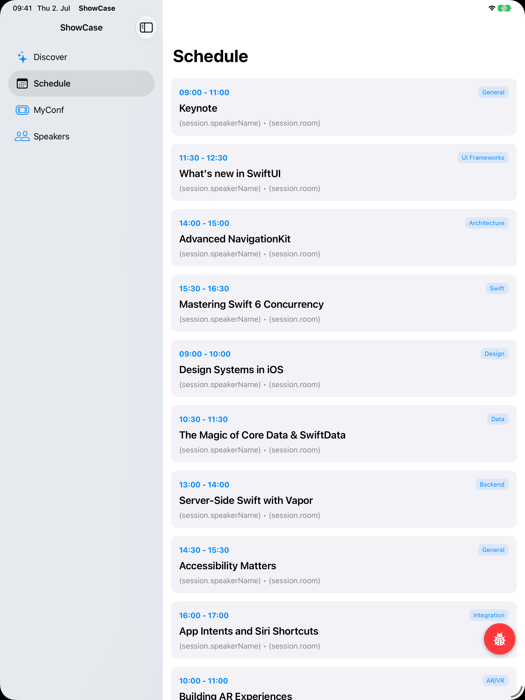
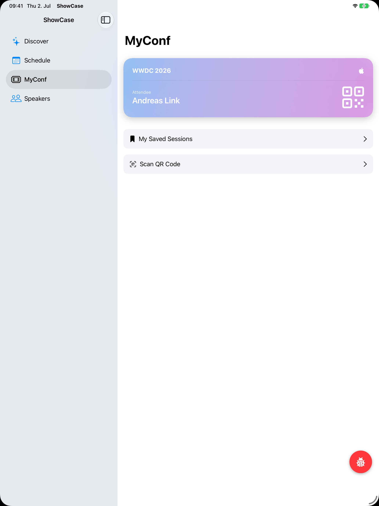
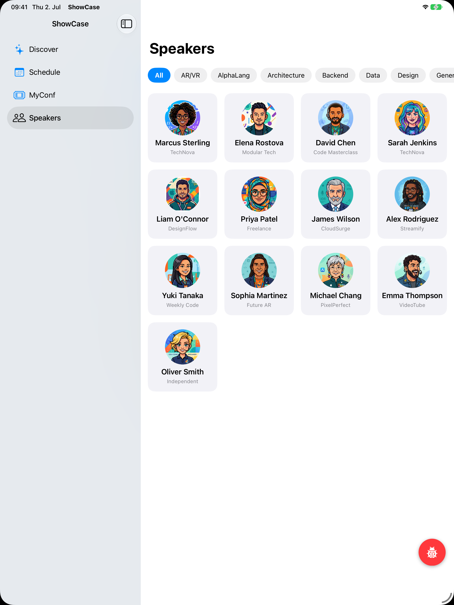

<div align="center">
  <picture>
    <source media="(prefers-color-scheme: dark)" srcset="Documentation/NavigationKit-editorial-dark.svg">
    
  </picture>

  [](https://github.com/linkandreas/NavigationKit/actions/workflows/ci.yml)
  [](https://github.com/linkandreas/NavigationKit/actions/workflows/ci.yml)
  [](https://github.com/linkandreas/NavigationKit/actions/workflows/ci.yml)
  [](https://github.com/linkandreas/NavigationKit/actions/workflows/ci.yml)
  [](https://swift.org)
  [](https://apple.com/ios)
  [](https://apple.com/macos)
  [](https://swift.org/package-manager/)
  [](https://opensource.org/licenses/MIT)

</div>

---

`NavigationKit` gives every screen one small, layout-agnostic API — `push`, `present`, `show`, `select`, `dismiss` — and builds the right SwiftUI containers around it: a stack, a tab bar, a sidebar with detail, or all of them adaptively. Navigation state is plain `Codable` data, so deep links, state restoration, Handoff and tests all fall out for free.

```swift
NavigationRoot(selection: AppTab.discover) {
    RootSection(AppTab.discover, "Discover", icon: "sparkles") { DiscoverRoute.home }
    RootSection(AppTab.schedule, "Schedule", icon: "calendar") { ScheduleRoute.list } detail: { ScheduleRoute.placeholder }
}
.layout(.adaptive)                       // tabs on iPhone, sidebar + detail on iPad and Mac
.routes(DiscoverModule(), ScheduleModule())
.deepLinks(AppLinks.self)
.restoration(.sceneStorage("navigator"))
```

```swift
enum ScheduleRoute: Route {
    case list, placeholder, session(id: String)
}

struct ScheduleModule: RouteModule {
    func body(for route: ScheduleRoute, navigator: RouteNavigator<ScheduleRoute>) -> some View {
        switch route {
        case .list:        SessionList(onSelect: { navigator.show(.session(id: $0)) })   // detail column or push
        case .placeholder: ContentUnavailableView("Select a session", systemImage: "calendar")
        case let .session(id): SessionDetail(id: id)
        }
    }
}
```

```swift
let registration = await navigator.flow(HackathonRegistration())   // a reusable flow, started as one unit
```

## 💡 What issues does it solve?

- **Screens don't know their layout.** A navigator is scoped to the screen that receives it; actions travel up the tree to whichever container can handle them. The same feature works in a tab, a sidebar, a sheet or a window.
- **One verb per intent.** `present(route, as: .sheet(detents: [.medium]))` instead of a modifier per presentation type. Routes can declare traits (`presentation`, `requiresAuth`, `hidesTabBar`), so most call sites are just `navigator.open(route)`.
- **Results come back to the caller, not through state.** `navigator.present(.picker, returning: Color.self) { color in … }`, `navigator.confirm("Delete?") { … }` — or `await` them.
- **Dependencies live exactly as long as they're needed.** `navigator.remember(for: .flow) { CheckoutSession() }` creates a dependency on first use and releases it when the flow ends — no app-level containers.
- **Flows own their steps.** A `Flow` declares its input, steps and result, and one `FlowModule` wires all its screens. Callers start it as a unit, or run it as one step of their own flow, and get a type-checked result; nothing outside the flow can show its steps.
- **Layout-independent paths.** Deep links, `navigate(_:)`, restoration and test assertions all use the same `[Step]` language — no branching on tabs vs. split.
- **No SwiftUI in your models.** The `NavigationKitInterface` target has routes, the `Navigator` protocol, steps and dialogs; view models and route-contract packages depend on it alone.
- **No timing hacks.** Nested presentations are sequenced on real appear/disappear signals.

## 🛠 Requirements

- **iOS** 26.0+
- **macOS** 26.0+
- **Swift** 6.4+
- **Xcode** 27+

On macOS, `.cover` presents a sheet (there is no full-screen cover). Routes, navigators,
snapshots, and deep links behave identically on both platforms — see
[Modals & Dialogs](Documentation/ModalsAndDialogs.md).

---

## 🚀 Installation

### Swift Package Manager

Add `NavigationKit` to your `Package.swift`:

```swift
dependencies: [
    .package(url: "https://github.com/linkandreas/NavigationKit.git", from: "4.1.0")
]
```

Then add the product(s) you need to your target:

```swift
.target(
    name: "MyApp",
    dependencies: [
        .product(name: "NavigationKit", package: "NavigationKit"),
        // Optional: RecordingNavigator for unit tests.
        .product(name: "NavigationKitTesting", package: "NavigationKit"),
        // Optional: a floating debugger overlay for DEBUG builds.
        .product(name: "NavigationKitDebug", package: "NavigationKit"),
    ]
)
```

Or, in Xcode: **File ▸ Add Package Dependencies…** and paste the repository URL.

---

## 📖 Quick Start

### 1. Define routes

A route is a plain value — no SwiftUI, so it can live in a lightweight package other features import.

```swift
import NavigationKit

enum SpeakersRoute: Route {
    case overview
    case detail(id: String)
    case contact(email: String)

    var presentation: PresentationStyle? {          // trait: how `open` shows it
        if case .contact = self { .sheet(detents: [.medium, .large]) } else { nil }
    }
}
```

### 2. Give them screens

A module maps each route to its screen. The `switch` is exhaustive, so a new case without a screen
won't compile:

```swift
struct SpeakersModule: RouteModule {
    func body(for route: SpeakersRoute, navigator: RouteNavigator<SpeakersRoute>) -> some View {
        switch route {
        case .overview:
            SpeakerList(onSelect: { navigator.push(.detail(id: $0)) })
        case let .detail(id):
            SpeakerDetail(id: id, onContact: { navigator.open(.contact(email: $0)) })
        case let .contact(email):
            MailComposer(to: email, onDone: { navigator.dismiss() })
        }
    }
}
```

### 3. Declare the root

```swift
struct ContentView: View {
    var body: some View {
        NavigationRoot(SpeakersRoute.overview)          // a single stack…
            .routes(SpeakersModule())
    }
}
```

…or sections that adapt to the window:

```swift
NavigationRoot(selection: AppTab.speakers) {
    RootSection(AppTab.speakers, "Speakers", icon: "person.2") { SpeakersRoute.overview }
    RootSection(AppTab.account, "Account", icon: "person.crop.circle") { AccountRoute.profile }
}
.layout(.adaptive)
.routes(SpeakersModule(), AccountModule())      // call .routes as often as you like; modules add up
```

### 4. Navigate

```swift
navigator.push(.detail(id: "s1"))
navigator.show(.detail(id: "s1"))          // split detail column, or push in compact width
navigator.open(.contact(email: "a@b.c"))   // push or present, per the route's trait
navigator.confirm("Discard changes?", confirm: "Discard", destructive: true) { navigator.pop() }
```

The [cheat sheet](#-cheat-sheet) below lists everything else.

### 5. Test without views

```swift
@Test @MainActor func selectingASpeakerPushesDetail() {
    let navigator = RecordingNavigator()
    SpeakerListModel(navigator: navigator).didSelect(id: "s1")
    #expect(navigator.actions == [.push(AnyRoute(SpeakersRoute.detail(id: "s1")))])
}
```

---

## 📋 Cheat Sheet

### Routes and traits

```swift
enum ScheduleRoute: Route {                      // Route = Hashable + Codable + Sendable
    case list, placeholder, session(id: String), filter

    var presentation: PresentationStyle? {       // used by open(_:)
        if case .filter = self { .sheet(detents: [.medium]) } else { nil }
    }
    var hidesTabBar: Bool { if case .session = self { true } else { false } }
    var requiresAuth: Bool { false }
}
```

### Root

```swift
NavigationRoot(selection: AppTab.home) {
    RootSection(AppTab.home, "Home", icon: "house") { HomeRoute.feed }
    RootSection(AppTab.schedule, "Schedule", icon: "calendar") {
        ScheduleRoute.list
    } detail: {                                   // three columns in regular width
        ScheduleRoute.placeholder
    }
}
.layout(.adaptive)            // .stack | .tabs | .split | .adaptive
.routes(HomeModule(), ScheduleModule())       // every route's screens; chainable
.deepLinks(AppLinks.self)
.restoration(.sceneStorage("navigator"))
.onNavigationEvent { Analytics.track($0) }
.navigationDebugger()         // NavigationKitDebug
```

- A flow as a tab: `RootSection(AppTab.order, "Order", icon: "cart", flow: Checkout()) { order in … }` — finishing starts it over
- Single stack: `NavigationRoot(HomeRoute.feed)`
- A store you own (navigate from outside the views, or in tests): `NavigationRoot(store: store)`
- Your own sidebar: `NavigationRoot(selection: Tab.a) { … } sidebar: { selection in MySidebar(selection: selection) }`

### Screens for routes

**`RouteModule`** — the screens for one route type, with whatever the screens need injected:
stores, view models, or other features' routes. The `switch` must be exhaustive, so a new case
without a screen won't compile:

```swift
struct ScheduleModule: RouteModule {
    let store: ScheduleStore

    func body(for route: ScheduleRoute, navigator: RouteNavigator<ScheduleRoute>) -> some View {
        switch route {
        case .list: ScheduleList(store: store, onSelect: { navigator.show(.session(id: $0)) })
        case let .session(id): SessionView(store: store, onSpeaker: { navigator.push(SpeakersRoute.detail(id: $0)) })
        }
    }
}
```

For several route types in one module, conform to `NavigationModule` and call `registry.register { (route: R, navigator) in … }` per type.

Deep inside a view tree, `@Environment(\.navigator) var navigator` gives the screen's navigator.

### Dependencies and their lifetime

```swift
func body(for route: CheckoutRoute, navigator: RouteNavigator<CheckoutRoute>) -> some View {
    let api     = navigator.remember(for: .window) { CheckoutAPI() }               // the whole window
    let session = navigator.remember(for: .flow)   { CheckoutSession(api: api) }   // one checkout run
    switch route {
    case .review: ReviewScreen(session: session, onNext: { navigator.push(.payment) })
    // …
    }
}
```

Created the first time it's asked for, the same value on every later ask, released when the
lifetime ends: `.screen` (popped or dismissed), `.flow` (finished, cancelled or backed out of),
`.flow(Checkout.self)` (that enclosing flow), `.window` (the `NavigationRoot`). Values are told
apart by type. Screens keep plain initializers.

The same as a view, where wrappers nest to show the composition:

```swift
case .review:
    WithDependency(for: .window) { CheckoutAPI() } content: { api in
        WithDependency(for: .flow) { CheckoutSession(api: api) } content: { session in
            ReviewScreen(session: session, onNext: { navigator.push(.payment) })
        }
    }
```

### Navigating

```swift
navigator.push(.detail(id: "1"))
navigator.pop(); navigator.popToRoot(); navigator.pop(to: .list)   // pop(to:) returns Bool
navigator.open(.filter)                                            // push or present, per the trait
navigator.show(.session(id: "1"))                                  // detail column in split; push otherwise
navigator.select(AppTab.schedule)                                  // switch tab or sidebar section
navigator.navigate([.select(AppTab.schedule), .show(ScheduleRoute.session(id: "42"))])
navigator.open(URL(string: "myapp://schedule/session/42")!)
```

`navigate(_:)` replaces the current location: it asks the guards of everything it would discard,
dismisses open modals, resets the section to its root, then applies the steps in order — each one
inside whatever the previous step opened.

### Modals and results

```swift
navigator.present(.filter)               // the trait, else a sheet
navigator.present(.player, as: .cover)   // .sheet, .sheet(detents:), .cover, .cover(zoomFrom:),
                                         // .popover, .inspector, .window
navigator.dismiss()

navigator.present(PaymentRoute.add, returning: Card.self) { card in   // nil if swiped away
    if let card { model.use(card) }
}
navigator.dismiss(returning: card)                                    // in the presented screen

let card = await navigator.present(PaymentRoute.add, returning: Card.self)   // or await the result
```

For a zoom transition, mark the source with `.navigationZoomSource("photo-1")` and present with
`.cover(zoomFrom: "photo-1")`. `.window` needs a `RouteWindows(...)` scene and falls back to a sheet.

### Dialogs

Texts are `LocalizedStringResource`s, looked up in your string catalog.

```swift
navigator.confirm("Delete?", message: "…", confirm: "Delete", destructive: true) { model.delete() }
navigator.alert("Saved") { … }
navigator.retry(error) { model.reload() }

navigator.dialog("Share", style: .confirmation) {
    Dialog.Action("Copy Link") { model.copyLink() }     // each action's closure runs when chosen
    Dialog.Action("Cancel", role: .cancel)
}
```

Every call also has an `async` form that returns the outcome, for code that's already in a `Task`:
`if await navigator.confirm("Delete?") { … }`, `let choice = await navigator.dialog("Share") { … }`.

### Flows, guards and auth

```swift
struct Checkout: Flow {                              // owns its steps; a plain value
    typealias Result = Order
    let cart: Cart                                   // input, seen by every step
    enum Step: Hashable, Codable, Sendable { case review, payment, done(Order) }
    var start: Step { .review }
}

struct CheckoutScreens: FlowModule {                 // the whole flow in one switch
    func body(for step: Checkout.Step, in flow: Checkout, navigator: FlowNavigator<Checkout>) -> some View {
        switch step {
        case .review:          ReviewScreen(cart: flow.cart, onNext: { navigator.next(.payment) })
        case .payment:         PaymentScreen(onPaid: { navigator.next(.done($0)) }, onCancel: { navigator.cancel() })
        case let .done(order): DoneScreen(onClose: { navigator.finish(order) })    // typed result
        }
    }
}

navigator.flow(Checkout(cart: cart)) { order in … }          // runs only if the flow finishes
let order = await navigator.flow(Checkout(cart: cart))       // Order?, nil if abandoned
navigator.flow(AddressFlow()) { navigator.next(.pay($0)) }   // in a step: run another flow as a step

FormScreen()
    .navigationGuard(when: hasChanges)                          // built-in "Discard changes?"
    .navigationGuard(when: hasChanges) { await askToSave() }    // or your own check
```

Guards cover back, swipe-to-dismiss, tab switches with modals open, and deep links.
`.authGate(isAuthenticated: { session.isLoggedIn }, login: AuthRoute.login)` on the root presents
the login before any route with `requiresAuth`, then continues once it's dismissed with `true`.

### Deep links and restoration

```swift
enum AppLinks: DeepLinks {
    static func steps(for url: URL) -> [Step]? {
        guard url.segments.first == "schedule", let id = url.segments.last else { return nil }
        return [.select(AppTab.schedule), .show(ScheduleRoute.session(id: id))]
    }
}
```

- Restoration: `.restoration(.sceneStorage("navigator") | .userDefaults("navigator") | .custom(load:save:))`
- Handoff: `.handoff(activityType: "com.example.view")`
- State as data: `store.snapshot` (`Codable`), `await store.restore(snapshot)`, `store.currentSteps`

### Testing

```swift
// A screen's or view model's logic, without views.
let navigator = RecordingNavigator()
model.didSelect("s1", navigator: navigator)
#expect(navigator.actions == [.push(AnyRoute(SpeakersRoute.detail(id: "s1")))])
navigator.answerDialogs(with: "Delete")   // or navigator.dialogResponse = { … }
navigator.results[AnyRoute(PaymentRoute.add)] = card
navigator.end(.flow)                      // release what was remembered for the flow

// Every route has a screen (catches a module missing from .routes(…)).
#expect(RouteRegistry(appModules).missingViews(for: [ScheduleRoute.self, SpeakersRoute.self]).isEmpty)

// The whole app's navigation, headless.
let store = NavigationStore(layout: .adaptive, selection: AppTab.home, sections: [...])
await store.navigate([.select(AppTab.schedule), .push(ScheduleRoute.list)])
#expect(store.currentSteps == [.select(AppTab.schedule), .push(ScheduleRoute.list)])
```

### Good to know

- `navigate` takes an array of steps; there is no builder for it.
- In dialog builders, write `Dialog.Action(…)` initializers. The `.default`/`.cancel`/`.destructive`
  shortcuts are for array literals — on consecutive builder lines Swift chains them into one call.
- Section ids must be `Hashable & Sendable`. In an app target that defaults to `MainActor`
  isolation, mark routes and section-id enums `nonisolated`.
- With `MemberImportVisibility`, files that pass `LocalizedStringResource` (section titles, dialog
  texts) need `import Foundation`.
- `show` replaces the detail column in split layouts; use `push` to go deeper in the same column.
- Split-view column widths and visibility aren't configurable yet; size a custom sidebar with
  `.navigationSplitViewColumnWidth`.

---

## 📚 Documentation & Guides

- [Layouts](Documentation/Layouts.md) — single stack, tabs, split, adaptive; `show` and the detail column
- [Modals & Dialogs](Documentation/ModalsAndDialogs.md) — presentation styles, detents, zoom, windows, awaited results, dialogs
- [Flows, Guards & Auth](Documentation/FlowsGuardsAndAuth.md) — reusable, composable flows, unsaved-changes guards, the auth gate
- [Routes & Modules](Documentation/RoutesAndModules.md) — `Route`, `RouteModule`, cross-feature navigation, `RouteLink`
- [Deep Linking](Documentation/DeepLinking.md) — `[Step]`, `DeepLinks`, `navigate`
- [Restoration & Handoff](Documentation/Restoration.md) — snapshots, lossy decoding, versioning
- [Testing](Documentation/Testing.md) — `RecordingNavigator`, headless `NavigationStore`
- [Debugging](Documentation/Debugging.md) — the event stream and the debugger overlay
- [Migration](Documentation/Migration.md) — to 3.0 from 2.x, and to 2.0 from 1.x or plain `NavigationStack`

The full API reference is published as DocC.

---

## 🧩 ShowCase App

[`ShowCaseApp`](Examples/ShowCaseApp) is a multi-module conference app that exercises the whole framework. Open `ShowCaseApp.xcodeproj` and run the `ShowCaseApp` scheme.

### iPhone

<table width="100%">
  <tr>
    <th align="center">Discover</th>
    <th align="center">Schedule</th>
    <th align="center">My Conf</th>
    <th align="center">Speakers</th>
  </tr>
  <tr>
    <td width="25%" align="center">
      
    </td>
    <td width="25%" align="center">
      
    </td>
    <td width="25%" align="center">
      
    </td>
    <td width="25%" align="center">
      
    </td>
  </tr>
</table>

### iPad

<table width="100%">
  <tr>
    <th align="center">Discover</th>
    <th align="center">Schedule</th>
  </tr>
  <tr>
    <td width="50%" align="center">
      
    </td>
    <td width="50%" align="center">
      
    </td>
  </tr>
  <tr>
    <th align="center">My Conf</th>
    <th align="center">Speakers</th>
  </tr>
  <tr>
    <td width="50%" align="center">
      
    </td>
    <td width="50%" align="center">
      
    </td>
  </tr>
</table>

Highlights:
- Adaptive root navigator (tab bar on iPhone, sidebar + detail split view on iPad).
- Per-feature Swift packages registering their own routes.
- Composed flows: hackathon registration runs a reusable proof flow as one of its steps.
- Modal sheets hosting nested stacks.
- Deep links resolving into a selected tab and path simultaneously.

---

## 🏗 Architecture Overview

```
NavigationRoot ── NavigationStore (@Observable)
                   └─ SectionNode × n            tab / sidebar item
                       ├─ StackNode (main)       root + path + modal? + dialog?
                       │   └─ ModalNode          style + StackNode (recursive)
                       └─ StackNode (detail)?    split-view detail column
```

Every screen receives a navigator bound to its `StackNode`. An action is resolved there or bubbles up: `push`/`pop` stay on the stack, `dismiss` goes to the nearest modal, `show` to the section's detail column, `select`/`navigate`/`open(url)` to the store. The store is the single source of truth; the views are a projection of it.

## 🤝 Modules

| Product | Contents | Depends on |
|---|---|---|
| `NavigationKitInterface` | `Route`, `Flow`, `Navigator`, `RouteNavigator`, `Step`, `Dialog`, `PresentationStyle`, events — **no SwiftUI** | Foundation |
| `NavigationKit` | `NavigationRoot`, `NavigationStore`, `NavigationModule`, `RouteRegistry`, guards, restoration | Interface (re-exported) |
| `NavigationKitTesting` | `RecordingNavigator` | Interface |
| `NavigationKitDebug` | `.navigationDebugger()` overlay | NavigationKit |

## 🧪 Testing

```bash
xcodebuild test -scheme NavigationKit-Package -destination 'platform=iOS Simulator,name=iPhone 17'
```

The suite drives a headless `NavigationStore` — no simulator UI involved — and asserts on `currentSteps`.

## 🤝 Contributing

Contributions are welcome — see [CONTRIBUTING.md](CONTRIBUTING.md) for how to set up the project, run the test suite, and submit changes. Please also read the [Code of Conduct](CODE_OF_CONDUCT.md).

## 📄 License

`NavigationKit` is released under the MIT license. See [LICENSE](LICENSE) for details.
